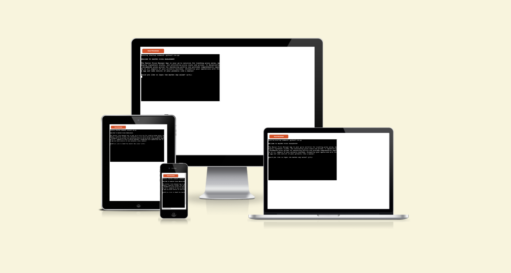

# Master Pizza Manager App

## <a href="https://master-pizza-manager-61f1c0f42ac1.herokuapp.com/" target="_blank">Live version of Master Pizza App</a>

## The Master Pizza Manager App is a comprehensive pizza sales and costs management tool designed for pizzerias. This app allows the user to effectively track pizza sales, ingredient stock, ingredient costs, and the costs associated with producing individual types of pizzas. It also provides a dynamic pizza selling price recommendation based on the cost of production and a desired profit margin.

## Key Features:

- Pizza Sales Tracking: The app tracks the number of each type of pizza sold, and keeps this information updated in a 'pizza sales' worksheet.

- Ingredient Stock Management: The app allows users to keep track of the amount of ingredients left in stock, updating this information in an 'ingredients stock' worksheet.

- Ingredient Costs: The app tracks the cost of each ingredient per kilogram in an 'ingredients kg prices' worksheet.

- Pizza Cost Calculation: For each type of pizza, the app calculates the cost of production based on the ingredients used and the cost per kilogram of each ingredient. This information is stored in a 'pizza cost' worksheet.

- Pizza Price Recommendation: The app provides a dynamic selling price recommendation for each type of pizza. This is calculated by adding a fixed cost per pizza (determined by the pizzeria's fixed costs divided by the number of pizzas sold on the last market day) and a 35% profit margin to the cost of each pizza. This information is updated in a 'pizza selling price' worksheet.

- Profit Calculation: The app calculates the profit for each type of pizza by subtracting the cost from the selling price, and stores this data in a 'profit' worksheet.

- Reporting: The app generates comprehensive reports, providing the user with a clear overview of their pizza business. It can display reports on pizza sales, ingredient stock, ingredient costs, pizza costs, recommended selling prices, and profit.

- Automated Worksheet Updating: The app can automatically send updated data to the relevant worksheets, keeping all records up-to-date.

- In conclusion, the Master Pizza Manager App is a powerful tool that simplifies pizza sales and cost management, allowing pizzerias to effectively monitor their operations, reduce waste, and maximize profit.

Future Features

- Generate shopping list
- Add new pizza flavors
- Add the possibility of changing the profit margin
- Add the possibility of choosing the number of market days in the report

## Data Model

### MasterPizzaManager

- The core data model of the application is represented by the MasterPizzaManager class. This class represents the overall manager of the pizzeria and contains several key fields:

- fixed_costs: a float that represents the pizzeria's fixed costs.
ingredients_constant_dict: a dictionary with the weight (in kg) of each ingredient that is constant in all pizzas.
The MasterPizzaManager class has several methods that are responsible for managing the pizzeria's operations:

- calculate_pizza_cost: This method calculates the cost to manufacture each type of pizza based on ingredient costs, the pizzeria's fixed costs, and sales data.

- calculate_pizza_price: This method calculates the selling price for each type of pizza, adding a 35% profit margin to the cost.

- send_dict_to_sheet: This method sends the values of a dictionary to a specified worksheet in a Google Sheet. It's a reusable method for updating various worksheets.

- generate_report: This method generates reports from all worksheets, including pizza sales, ingredient stock, ingredient prices, pizza costs, and profit.

- Google Sheets
The app heavily relies on Google Sheets for storing and manipulating data. It uses multiple worksheets within a single Google Sheet, each of which stores data related to a specific aspect of the pizzeria:

- pizza sales: tracks the sales of different types of pizzas.
- ingredients stock: manages the inventory of various ingredients.
- ingredients kg prices: stores the prices per kg of different ingredients.
- pizza cost: records the cost of manufacturing each type of pizza.
- pizza selling price: keeps track of the selling price of each type of pizza.
- profit: calculates the profit earned from selling pizzas.
- ingredients used: keeps track of the quantity of ingredients used in the pizza.
- Each of these worksheets corresponds to a different report that the MasterPizzaManager can generate, providing a comprehensive overview of the pizzeria's operation.

- This data model, in combination with the use of Google Sheets as a flexible, cloud-based data storage system, allows the MasterPizzaManager to provide a rich and comprehensive management tool for pizzeria owners.

## Testing

### Functionality Testing
- Market Day Sales Input
- Run the application.
- Select "Yes" when asked to input the market day sales.
- Input the number of pizzas sold in each category.
- Verify that the sales numbers are correctly updated in the application and the database.
### Pizza Price Calculation
- Run the application.
- Select "Yes" when asked to calculate pizza prices.
- Verify that the prices calculated are as expected, given the costs of ingredients and the margin applied.
### Updating Ingredient Prices
- Run the application.
- Select the option to update ingredient prices.
- Input new prices for ingredients.
- Verify that the prices have been updated in the database and are correctly reflected in the application.
### Updating Pizza Cost
- Run the application.
- Select the option to calculate pizza cost.
- Verify that the pizza cost is calculated correctly based on the current prices of ingredients.
## Error Handling
- Input invalid data (such as a string where a number is expected) and ensure the application handles the error gracefully.
- Simulate a loss of database connectivity to verify that the application handles it well and doesn't crash.
### User Interface
- Confirm that all prompts, inputs, and outputs are clearly legible and correctly formatted.
- Verify that all menu options work as expected and lead to the correct parts of the application.

## Bugs

### Solved bugs

-I had many bugs: I lost eight hours trying different versions of 2 methods and then figured out the Google sheet was the problem. I deleted the sheet and made a new one. After 8 hours, A 2-minute task solved the bug.

### Remaining bugs
- No bugs remaining 

# Validator testing

## pep8
- I hade some errors: 
- E501 line too long (160 > 79 characters)
- E501 line too long (83 > 79 characters)
- 33: E501 line too long (82 > 79 characters)

- What happened is the following: I fixed all the trailing whitespaces that had hundreds of errors
fixed, all of them related to formatting, like the line being too long, the blank line containing whitespace, and indentation errors; the indentation is what broke my text.
But then I tested my code, and all the printed and input text was broken with long spaces between the words... unreadable then I had to return to the older running version of the code. 
I hope it's not an issue. I know it's a requirement, but I had some problems with my project, and now I have two hours to deliver impossible to correct all the errors again. I apologize.

## Deployment

- Deployment to Heroku from GitHub
Create a New Application on Heroku

- Log in to your Heroku account and navigate to the dashboard.
- Click on New -> Create New App, and provide a unique name for your app (<your-app-name>).
- Setup Heroku Deployment from GitHub

- In your app's dashboard, navigate to Deploy tab.
- Under Deployment Method, choose GitHub.
- In the Connect to GitHub section, search for the GitHub repository (<your-repository-name>) you want to connect with your Heroku app and click Connect.

### Configure Your App's Settings

- Navigate to the Settings tab in your app's dashboard.
- Under the Config Vars section, click on Reveal Config Vars.
- Set the necessary environment variables for your application ("KEY, VALUE": CREDS, creds.json and PORT 8000).

### Enable Automatic Deploys

Navigate back to the Deploy tab and scroll down to the Automatic Deploys section.
Select the branch from your GitHub repository that you want to deploy automatically.

If you want to manually deploy your application, scroll down to the Manual Deploy section, select the branch you want to deploy, and click Deploy Branch.

## Credits
- Inspired by code Love Sandwiches
## Resources 
- https://codeinstitute.net/de/ 'returned to the lessons'
- https://docs.gspread.org/en/latest/ Google spreadsheet
- https://www.learnpython.org/ resources: 'for-loops iteration, 'if' statements, Python, list comprehensions provide a concise way to create lists.
- https://codereview.stackexchange.com/questions/279955/simplify-nested-list-comprehension Nested list comprehension
- https://blog.enterprisedna.co/python-dictionary-comprehension-tutorial/ dictionary comprehension
- https://www.google.com search engine

# Final comments:
- It was a learning journey with moments of joy and moments of rage and despair =). Looking forward to the next challenge. 

- Thanks Humberto Pereira
